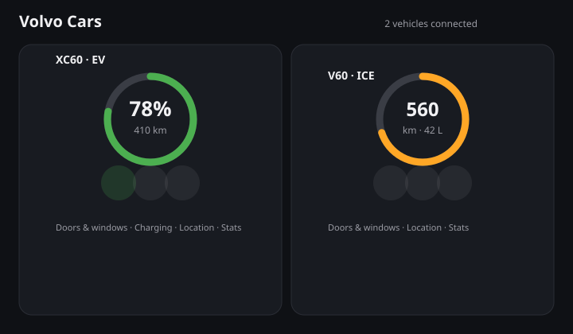

# Volvo Cars Card for Home Assistant

A custom Lovelace card for one or more Volvo vehicles connected through Home Assistant's **official `Volvo` integration** (Volvo Cars API — supports both electric/plug-in hybrid and combustion vehicles).

Unlike many custom cards, this one requires no external dependencies — no charting library, no map library. Everything is rendered with native SVG and plain HTML, and it reads your vehicles' data by auto-discovering entities from the HA **device** you pick for each car, instead of asking you to hand-pick 15+ individual entity IDs.



---

## Features

- **Auto-discovery** — pick each vehicle's HA device once; the card finds its battery/fuel, range, lock, door/window, charging, location and consumption entities on its own
- **Battery or fuel overview** — a range/charge ring for electric and plug-in hybrid vehicles, a plain range readout for combustion vehicles (no fake gauge when there's no real percentage to show)
- **Doors & windows** — a top-down diagram highlighting only the open door/window/hood/tailgate, plus a plain-text summary
- **Quick actions** — lock/unlock, climatization on/off, horn & lights, all calling the vehicle's real Home Assistant services
- **Charging status** (electric/plug-in hybrid only) — status, power, time left, target level; the whole section is simply absent for a combustion-only vehicle, not just hidden
- **Location** — an "open in map" link from the vehicle's device tracker
- **Consumption trend** — a small sparkline built from Home Assistant's own History API (average energy or fuel consumption over a configurable window)
- **Multiple vehicles** in one card, each configured independently
- Visual (GUI) editor — no YAML required to get started
- UI auto-translates to your Home Assistant language — English or Swedish (falls back to English)
- Theme-aware — uses Home Assistant's own CSS variables, matches your light or dark theme automatically
- Registers with `window.customCards` for the HA card picker

---

## Requirements

- Home Assistant's own **[Volvo integration](https://www.home-assistant.io/integrations/volvo)** must already be set up for your vehicle(s). This card does not talk to Volvo's API itself — it only reads the entities that integration creates.
- Not every vehicle exposes every entity (varies by model/market). The card simply hides a section or field it can't find data for.

---

## Installation

### Via HACS (custom repository)

This card isn't in the HACS default catalog yet. Add it as a custom repository:

1. HACS → ⋮ → **Custom repositories**
2. Repository: `https://github.com/johro897/volvo-cars-card`, Category: **Dashboard**
3. Install **Volvo Cars Card**, then reload your browser.

### Manual install

1. Copy `volvo-cars-card.js` to `/config/www/volvo-cars-card.js`
2. Add the resource in `configuration.yaml`:

```yaml
lovelace:
  resources:
    - url: /local/volvo-cars-card.js
      type: module
```

Or via the UI: **Settings → Dashboards → ⋮ → Resources → Add resource**

3. Restart Home Assistant (or reload resources).

---

## Configuration

Use the visual editor (**Edit dashboard → Add card → Volvo Cars Card**) to add each vehicle by picking its HA device — no YAML required.

### Options

| Option | Type | Default | Description |
|---|---|---|---|
| `vehicles` | list | **required**, at least one | Each entry: `device_id` (required, the HA device for that Volvo), `name` (optional display name override), `icon` (optional, currently unused, reserved) |
| `show_stats` | boolean | `true` | Show the consumption sparkline section |
| `stats_history_hours` | integer | `168` (7 days) | How far back the consumption sparkline looks |

```yaml
type: custom:volvo-cars-card
vehicles:
  - device_id: "01abc..."
    name: XC60
  - device_id: "01def..."
    name: V60
show_stats: true
```

---

## Not included (yet)

- **`engine_start`/`engine_stop`** (pre-heat the engine on a combustion/PHEV vehicle) — a possible follow-up, tracked as a GitHub issue.
- **An embedded map** instead of an "open in map" link — no map library is used in this project; a real embedded map would be a separate, larger decision.
- **Trip-by-trip history** (individual trips with date/distance/route, like Volvo's own app) — deliberately not built. Home Assistant's official `Volvo` integration only exposes cumulative trip-meter and average-speed sensors, not a per-trip list; the old `volvooncall` integration that did expose trip data is deprecated and known to over-poll Volvo's API.

---

## Troubleshooting

**A section or field is missing.** The card only shows what it can actually find under the device you picked. If your vehicle doesn't have that entity (e.g. no `sunroof` binary sensor, no charging sensors on a combustion car), the card hides that part rather than showing an empty placeholder.

**A vehicle shows "Waiting for data…" in place of the battery/fuel ring.** The card couldn't find a battery-percentage or fuel-amount sensor under that device yet. Give Home Assistant's Volvo integration a moment after setup, or check **Developer Tools → States** for that device's entities.

**Nothing shows up at all.** Make sure you picked the right HA **device** (not entity) in the editor — one device per vehicle, as created by the official Volvo integration.

---

## Changelog

### 0.5.0 (2026-09-12)

Initial early release — feedback and tweaks expected before a `1.0.0`.

- Auto-discovery of vehicle entities from a picked HA device (verified against the official `Volvo` integration's source)
- Battery/fuel overview, doors & windows diagram, lock/climate/horn quick actions, charging status, location link, consumption sparkline
- Multi-vehicle support, visual editor, EN/SV translations, theme-aware styling

---

## License

MIT — see [LICENSE](LICENSE).
