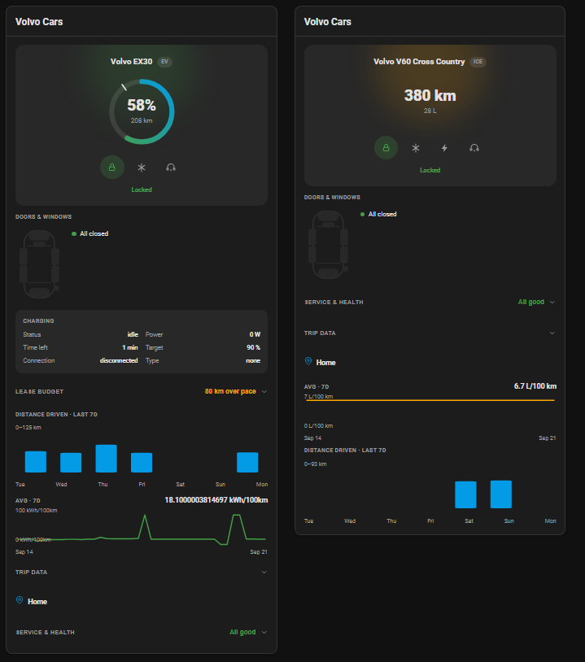
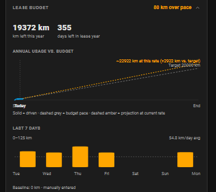

# Volvo Cars Card for Home Assistant

A custom Lovelace card for one or more Volvo vehicles connected through Home Assistant's **official `Volvo` integration** (Volvo Cars API — supports both electric/plug-in hybrid and combustion vehicles).

Unlike many custom cards, this one requires no external dependencies — no charting library, no map library. Everything is rendered with native SVG and plain HTML, and it reads your vehicles' data by auto-discovering entities from the HA **device** you pick for each car, instead of asking you to hand-pick 15+ individual entity IDs.



---

## Features

- **Auto-discovery** — pick each vehicle's HA device once; the card finds its battery/fuel, range, lock, door/window, charging, location and consumption entities on its own
- **Battery or fuel overview** — a range/charge ring for electric and plug-in hybrid vehicles, a plain range readout for combustion vehicles (no fake gauge when there's no real percentage to show)
- **Doors & windows** — a top-down diagram highlighting only the open door/window/hood/tailgate, plus a plain-text summary
- **Quick actions with confirm** — lock/unlock, climatization on/off, and horn/lights (offered separately as Horn, Lights, or Horn & lights) all call the vehicle's real Home Assistant services, but only after an extra confirm tap — the first tap just reveals the choice, nothing happens until you tap again
- **Charging status** (electric/plug-in hybrid only) — status, power, time left, target level; the whole section is simply absent for a combustion-only vehicle, not just hidden
- **Engine start/stop** (combustion/PHEV only) — same tap-to-confirm flow as the other actions
- **Service & health** — odometer, distance/time/engine-hours to service, and a curated set of fluid and tire-pressure warnings; collapsed to a one-line summary ("All good" or an issue count), expands to full detail on tap
- **Trip data** — trip meter and average speed for both the manual and automatic trip counters, collapsed to a one-line header by default
- **Vehicle photo** — an optional picture shown above the name (`picture` config option)
- **Location** — an "open in map" link from the vehicle's device tracker
- **Consumption trend** — a small sparkline built from Home Assistant's own History API (average energy or fuel consumption over a configurable window); automatically falls back between the integration's different sensor variants depending on which one your vehicle actually exposes
- **Distance driven** — a 7-day bar chart derived from odometer history (day-over-day distance, not a fake trip list)
- **Lease mileage budget** (optional) — set an annual km limit and your lease's start date, and the card shows how much you have left, whether you're on pace, and an annual usage chart with a projection at your current driving rate. The odometer baseline can be typed in or auto-detected from Home Assistant's own long-term statistics.
- **Reorderable sections** — choose which order Doors & windows, Charging, Service & health, Trip data, Position, Consumption stats, Distance driven, and Lease budget appear in, via the visual editor's up/down list
- **Multiple vehicles** in one card, each configured independently
- Visual (GUI) editor — no YAML required to get started
- UI auto-translates to your Home Assistant language — English or Swedish (falls back to English)
- Theme-aware — uses Home Assistant's own CSS variables, matches your light or dark theme automatically
- Registers with `window.customCards` for the HA card picker

---

## Requirements

- Home Assistant's own **[Volvo integration](https://www.home-assistant.io/integrations/volvo)** must already be set up for your vehicle(s). This card does not talk to Volvo's API itself — it only reads the entities that integration creates.
- Not every vehicle exposes every entity (varies by model/market). The card simply hides a section or field it can't find data for.

---

## Installation

### Via HACS (custom repository)

This card isn't in the HACS default catalog yet. Add it as a custom repository:

1. HACS → ⋮ → **Custom repositories**
2. Repository: `https://github.com/johro897/volvo-cars-card`, Category: **Dashboard**
3. Install **Volvo Cars Card**, then reload your browser.

### Manual install

1. Copy `volvo-cars-card.js` to `/config/www/volvo-cars-card.js`
2. Add the resource in `configuration.yaml`:

```yaml
lovelace:
  resources:
    - url: /local/volvo-cars-card.js
      type: module
```

Or via the UI: **Settings → Dashboards → ⋮ → Resources → Add resource**

3. Restart Home Assistant (or reload resources).

---

## Configuration

Use the visual editor (**Edit dashboard → Add card → Volvo Cars Card**) to add each vehicle by picking its HA device — no YAML required.

### Options

| Option | Type | Default | Description |
|---|---|---|---|
| `vehicles` | list | **required**, at least one | Each entry: `device_id` (required, the HA device for that Volvo), `name` (optional display name override), `icon` (optional, e.g. `mdi:car-electric`, shown next to the name), `picture` (optional image URL shown above the name, e.g. `/local/xc60.jpg`), `lease_annual_limit_km` (optional, enables the Lease budget section, e.g. `20000`), `lease_start_date` (required if the limit is set, `YYYY-MM-DD` — the lease's anniversary date, recomputed every year), `lease_start_odometer_km` (optional but recommended — the odometer reading at the start of the *current* lease year; if omitted, the card tries to auto-detect it from Home Assistant's long-term statistics for the odometer sensor), `lease_pace_tolerance_pct` (optional, default `3` — how many percent of the annual limit counts as "on pace" before the status flips to over/under), `lease_pace_basis` (optional, default `"today"` — `"today"` compares usage-so-far to a proportional target, `"projected"` compares the extrapolated year-end total to the limit instead, `"remaining_rate"` compares your actual recent daily average to the recalculated remaining daily budget) |
| `show_stats` | boolean | `true` | Show the consumption sparkline section |
| `stats_history_hours` | integer | `168` (7 days) | How far back the consumption sparkline looks |
| `layout` | string | `"auto"` | `"auto"` wraps to a single column when the dashboard column is too narrow; `"horizontal"` forces one column per vehicle, side by side, regardless of width; `"vertical"` always stacks vehicles in one column |
| `title` | string | *(none — auto-translated, "Volvo Cars"/"Volvo Cars")* | Card header text. Set to an empty string to hide the header row entirely. |
| `section_order` | list of strings | *(the order below)* | Controls the order of the sections below each vehicle's pinned hero (name/battery-fuel ring/quick actions, which is always first). Valid ids: `doors`, `charging`, `service`, `trip`, `position`, `stats`, `distance`, `lease` — default order is exactly that list. Applies to every vehicle in the card. A section a given vehicle doesn't have data for is skipped when rendering regardless of its position; an unknown id is ignored, and any id you leave out is appended after the ones you listed, so nothing is ever silently dropped. Easiest to set from the visual editor's "Section order" list (↑/↓ buttons) rather than by hand. |

```yaml
type: custom:volvo-cars-card
vehicles:
  - device_id: "01abc..."
    name: XC60
  - device_id: "01def..."
    name: V60
show_stats: true
```

---

## How the Lease budget is calculated

The Lease budget section (`lease_annual_limit_km` + `lease_start_date`) does several distinct calculations. This section spells out the exact formula behind every number it shows, so "80 km over pace" or "47 rest days needed" is never a mystery.



### Lease year and baseline

- **Lease year**: `lease_start_date`'s month/day recurs every year — the *current* lease year always starts on the most recent occurrence of that month/day that isn't in the future. You don't need to update the date yourself each year.
- **Baseline** (the odometer reading the current lease year started from): `lease_start_odometer_km` if you set it, otherwise auto-detected from Home Assistant's own long-term statistics (the odometer sensor's first recorded statistics point at or after the lease year's start).
- **`used`** = current odometer reading − baseline (never negative)
- **`remaining`** = `lease_annual_limit_km` − `used`
- **days elapsed / days left** = calendar days since / until the lease year's start, out of the full lease year's length (365 or 366 days)

### Pace status — `lease_pace_basis`

Three different ways to decide whether you're **on pace**, **over pace**, or **under pace**:

**`"today"` (default)**
```
expected by now = (days elapsed / days in lease year) × annual limit
deviation        = used − expected by now
```
Compares only what you've actually driven so far against a straight-line target for today's date. Doesn't look ahead to where that leaves you at year end.

**`"projected"`**
```
projected total = used × (days in lease year / days elapsed)
deviation        = projected total − annual limit
```
Extrapolates your year-to-date average across the *whole* year and compares that total to the limit — more forward-looking, but sensitive very early in the lease year (a small deviation on day 9 of 365 gets amplified roughly 40×). For that reason, the card doesn't actually use this basis until at least **21 days** have elapsed — before then it quietly falls back to the `"today"` calculation above and shows *"Collecting more data before projecting (day N of 365)"* instead of a premature, unstable number.

**`"remaining_rate"`**
```
remaining daily budget = remaining / days left
recent daily rate       = average of the last 7 days' actual driving (same data behind the "Last 7 days" chart below)
deviation               = recent daily rate − remaining daily budget
```
Compares two *rates* instead of extrapolating a distant total. This reacts to how you're driving right now without a single rested week masking a bad year-long trend — `remaining` already carries the full cumulative history, so a rested week just correctly reads as "under budget this week" — and there's no division *by* the recent rate, so it can never hit a divide-by-zero the way a naive short-window projection could.

Whichever basis is active, `deviation` is checked against a tolerance band before it's called "over" or "under":
```
tolerance = annual limit × (lease_pace_tolerance_pct / 100)     — default 3%
```
`deviation > tolerance` → **over pace**, `deviation < −tolerance` → **under pace**, otherwise **on pace**. (For `"remaining_rate"`, the tolerance scales with the remaining daily budget instead of the full annual limit, since that basis compares a daily rate, not a cumulative total.)

### Rest days needed

Shown alongside an "over pace" status under `"today"`/`"projected"` (hidden under `"remaining_rate"`, which already answers the same question directly via its own rate comparison):
```
rest days needed = days left − (remaining / (used / days elapsed))
```
In plain terms: *if I keep driving at my year-to-date average on the days I do drive, how many of the remaining days need to be 0 km to land at or under the limit?* Clamped between 0 and the number of days actually left, and always 0 once you're already over the annual limit (resting can't undo kilometers already driven). Like `"projected"`, this isn't shown until at least 21 days have elapsed, for the same reason.

### "Last 7 days" bars

A separate, independent calculation from everything above — colors each of the last 7 days' actual driving against a flat daily budget:
```
daily budget = lease_annual_limit_km / 365
```
No extrapolation and no tolerance band involved — just that day's actual distance compared straight to this fixed number, one bar per day, green if under and orange if over.

---

## Not included (yet)

- **An embedded map** instead of an "open in map" link — no map library is used in this project; a real embedded map would be a separate, larger decision.
- **A real street address** instead of coordinates/"Home" — would require an external reverse-geocoding service (e.g. OpenStreetMap Nominatim), which would be this project's first dependency outside Home Assistant's own API. Not pursued without an explicit decision to accept that tradeoff.
- **Individual window/sunroof remote control**, **exact tire pressure (PSI/kPa)**, and **charge scheduling** — none of these are exposed as controllable/available data by the Volvo integration as far as verified; not a card limitation.
- **Trip-by-trip history** (individual trips with date/distance/route, like Volvo's own app) — deliberately not built. Home Assistant's official `Volvo` integration only exposes cumulative trip-meter and average-speed sensors, not a per-trip list; the old `volvooncall` integration that did expose trip data is deprecated and known to over-poll Volvo's API. The distance-driven trend above is the closest honest substitute.
- Only a curated subset of the integration's warning sensors are shown (fluids, tire pressure) — the dozen individual light-bulb-failure warnings aren't included yet.

---

## Troubleshooting

**A section or field is missing.** The card only shows what it can actually find under the device you picked. If your vehicle doesn't have that entity (e.g. no `sunroof` binary sensor, no charging sensors on a combustion car), the card hides that part rather than showing an empty placeholder.

**A vehicle shows "Waiting for data…" in place of the battery/fuel ring.** The card couldn't find a battery-percentage or fuel-amount sensor under that device yet. Give Home Assistant's Volvo integration a moment after setup, or check **Developer Tools → States** for that device's entities.

**Nothing shows up at all.** Make sure you picked the right HA **device** (not entity) in the editor — one device per vehicle, as created by the official Volvo integration.

**No consumption stat/sparkline shows up even though I have a Volvo EV/combustion car.** The integration only creates a sensor at all if Volvo's API actually returns that specific field for your vehicle, and there are several variants of the consumption sensor. The card tries all of them, so if you still see nothing, check **Developer Tools → States** for any entity under your car's device whose name contains "average energy consumption" or "average fuel consumption" — if none exist at all, your vehicle simply doesn't expose this data via the integration.

**The vehicle icon (`icon:` config option) doesn't show up.** It's rendered with Home Assistant's own `<ha-icon>` element, which — unlike the custom `<select>` this card builds for the device picker — is not something built ourselves, so it's a (much lower-risk, but not zero-risk) assumption that it's always available. If it doesn't render, leave `icon` unset; nothing else depends on it.

**The Lease budget section shows "Collecting data…" and never resolves.** This means the card couldn't establish a baseline: no `lease_start_odometer_km` was set, and no long-term statistics were found for the odometer sensor going back to your lease's anniversary date. The most common cause is that Home Assistant simply hasn't been tracking the vehicle that far back yet. Fix: set `lease_start_odometer_km` manually — it's optional but recommended anyway, since the auto-detected value is only as precise as the nearest weekly statistics point.

---

## Changelog

### 1.0.0 (2026-09-21) — First stable release

Verified live against the owner's own two Volvo vehicles (an EV and a combustion car) across every section below, after just over a week of iteration since the `0.5.0` preview. Individual dated entries from that period are summarized here rather than kept one-by-one — see the [commit history](https://github.com/johro897/volvo-cars-card/commits/main) for the full trail.

- **Auto-discovery** from a single picked HA device — no manual entity mapping
- **Battery/fuel overview** with a range/charge ring (EV/PHEV) or plain range readout (combustion), a target-level marker on the ring, and an optional vehicle photo
- **Doors & windows** diagram plus a plain-text summary
- **Quick actions with confirm** — lock/unlock, climate on/off, horn/lights (Horn, Lights, or both separately), and engine start/stop on combustion/PHEV vehicles — every action needs an extra confirm tap before it actually calls a service
- **Charging status** (EV/PHEV) — status, power, time left, target, connection, type, current limit
- **Service & health** — odometer, distance/time/engine-hours to service, fluid and tire-pressure warnings, collapsed to a one-line summary by default
- **Trip data** — trip meter and average speed, manual and automatic counters
- **Location** — an "open in map" link
- **Consumption trend** and **Distance driven** charts — both full-width, with real axis labels and per-point hover tooltips
- **Lease mileage budget** (optional) — an annual km limit and countdown, a pace status computed from a choice of three bases (`today`/`projected`/`remaining_rate`, with a configurable tolerance), a "rest days needed" figure, an annual usage chart with a projection, and a "Last 7 days" daily-budget chart — baseline entered manually or auto-detected from Home Assistant's long-term statistics
- **Reorderable sections** (`section_order`) and a configurable **layout** (`auto`/`horizontal`/`vertical`) for multi-vehicle cards
- Visual (GUI) editor throughout — no YAML required for any of the above
- EN/SV translations, theme-aware styling, a checked-in dependency-free test suite (150 checks)

---

## License

MIT — see [LICENSE](LICENSE).
